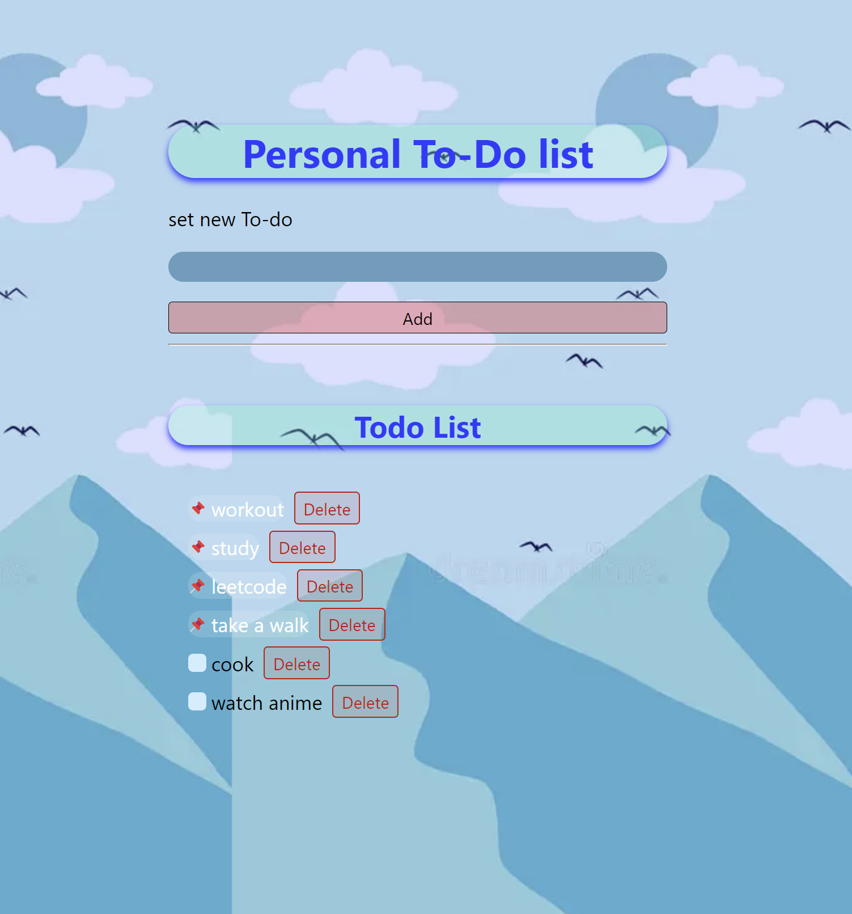

# My To-Do List

<h1>
Welcome to my to-do list!
</h1>

 This is a simple tool to help organize and manage my tasks effectively. I tried to code using react eith some help to learn.

## Features

- Mark tasks as completed
- Edit or delete tasks
- View tasks 

## Getting Started

To get started with using my to-do list, follow these steps:

1. Clone this repository to your local machine.
2. npm install necessary files
3. npm run dev
4. Start adding your tasks!

## Contributing

Contributions are welcome! If you have any suggestions for improvement or would like to report a bug, please [open an issue](https://github.com/yourusername/your-repository/issues).

